# 나만의 프롬프트 관리 프로그램

Python 콘솔 기반 프롬프트 저장·검색 프로그램입니다.
GenAI 미션들에서 작성했던 프롬프트를 카테고리별로 관리하고, 검색·즐겨찾기·조회수 기록까지 지원합니다.

---
GenAI 미션들에서 작성했던 프롬프트를 카테고리별로 관리하고, 검색·즐겨찾기·조회수 기록까지 지원합니다.

---

## 실행 방법

```bash
```bash
python main.py
```

Python 3.10 이상이 필요합니다. (개발 환경: Python 3.14.6)

---
```

Python 3.10 이상이 필요합니다. (개발 환경: Python 3.14.6)

---

## 기능 목록

### 필수 기능
### 필수 기능
- 프롬프트 추가
- 프롬프트 목록 보기
- 카테고리별 조회
- 프롬프트 검색 (제목/내용)
- 프롬프트 상세 보기
- 즐겨찾기 추가/제거
- 즐겨찾기 추가/제거
- 즐겨찾기 목록 보기

### 보너스 1 — 영속화 및 내보내기
- 프롬프트 데이터를 JSON 파일로 저장 (`prompts.json`)
- JSON 파일 불러오기
- 카테고리별 Markdown 파일 내보내기 (`prompts_export.md`)

### 보너스 2 — CRUD 및 사용 기록
- 프롬프트 수정
- 프롬프트 삭제
- 상세 보기 시 조회수 자동 기록
- 조회수 기준 Top 목록 정렬

---

### 보너스 1 — 영속화 및 내보내기
- 프롬프트 데이터를 JSON 파일로 저장 (`prompts.json`)
- JSON 파일 불러오기
- 카테고리별 Markdown 파일 내보내기 (`prompts_export.md`)

### 보너스 2 — CRUD 및 사용 기록
- 프롬프트 수정
- 프롬프트 삭제
- 상세 보기 시 조회수 자동 기록
- 조회수 기준 Top 목록 정렬

---

## 등록된 프롬프트 카테고리

텍스트 생성, 이미지 생성, 영상 생성, 페르소나, 자동화, 기타

기본 데이터로 등록된 3개 프롬프트는 이전 미션에서 실제로 작성했던 프롬프트입니다.

| 제목 | 카테고리 | 출처 |
|---|---|---|
| Project A 홈 화면 UI 생성 | 이미지 생성 | 캡스톤 디자인 프로젝트 (GPT Image 2) |
| 날씨 기반 Discord 코멘트 생성 (n8n) | 자동화 | n8n 자동화 워크플로우 과제 |
| VOLT 광고 씬2 냉각 팬 영상 프롬프트 | 영상 생성 | AI 광고 영상 제작 프로젝트 |

---

## 코드 구조

모든 기능은 함수 단위로 분리되어 있습니다.

```
main.py
├── input_non_empty()      # 빈 값 검증 공통 함수
├── choose_category()      # 카테고리 선택
├── add_prompt()           # 프롬프트 추가
├── show_list()            # 목록 조회
├── show_by_category()     # 카테고리별 조회
├── search_prompt()        # 검색
├── show_detail()          # 상세 보기 (조회수 기록 포함)
├── toggle_favorite()      # 즐겨찾기 추가/제거
├── show_favorites()       # 즐겨찾기 목록
├── save_to_json()         # JSON 저장 (보너스1)
├── load_from_json()       # JSON 불러오기 (보너스1)
├── export_to_markdown()   # Markdown 내보내기 (보너스1)
├── edit_prompt()          # 프롬프트 수정 (보너스2)
├── delete_prompt()        # 프롬프트 삭제 (보너스2)
├── show_top_viewed()      # 조회수 Top 정렬 (보너스2)
├── show_menu()            # 메뉴 출력
└── main()                 # 메인 루프
```

---

## 개발 환경

| 항목 | 버전 |
|---|---|
| Python | 3.14.6 |
| Git | 2.55.0 |
| 에디터 | VSCode + Python Extension |

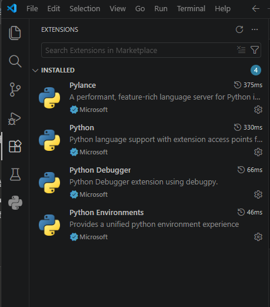

Git 설정은 공용 PC 사용을 고려해 `--local` 스코프로 지정했습니다. `--global`이 아닌 프로젝트 폴더 안(`.git/config`)에만 사용자 정보가 저장되어, 다른 사용자에게 영향을 주지 않습니다.

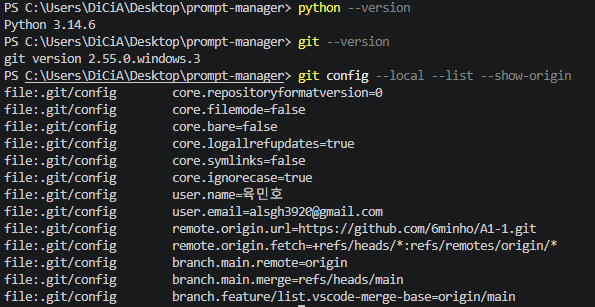

---

## 실행 화면

### 메뉴
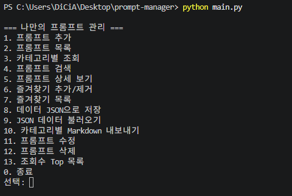

### 프롬프트 추가
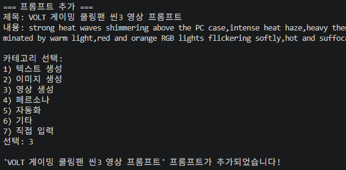

### 프롬프트 목록
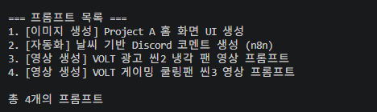

### 카테고리별 조회
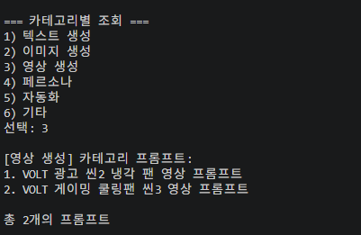

### 프롬프트 검색
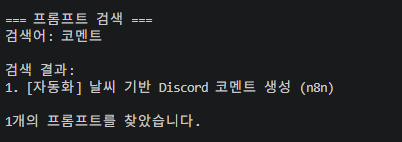

### 프롬프트 상세 보기 (조회수 기록)
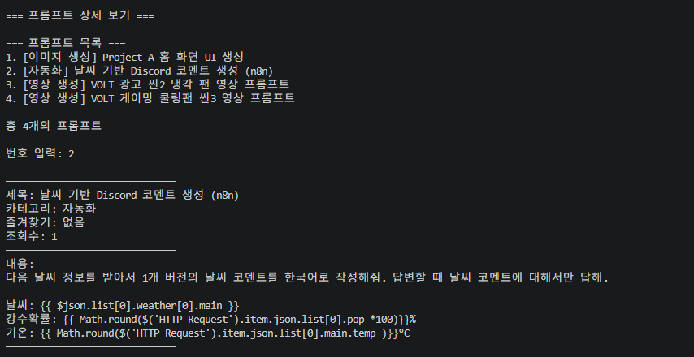

### 즐겨찾기 추가
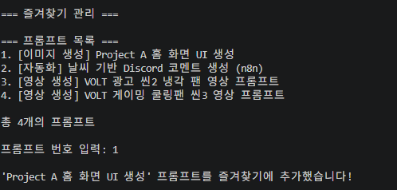

### 즐겨찾기 해제
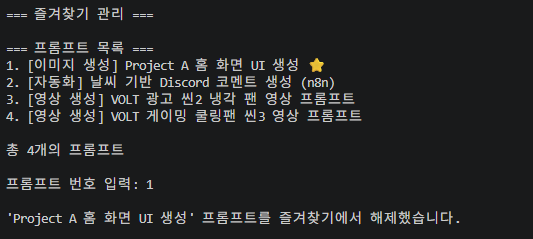

### 즐겨찾기 목록
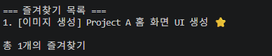

### JSON 저장 (보너스1)
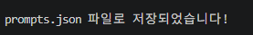

### 저장된 JSON 파일 내용
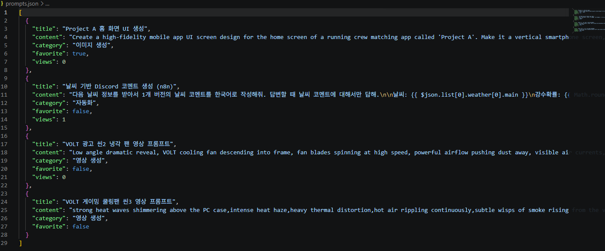

### Markdown 내보내기 실행 결과 (보너스1)
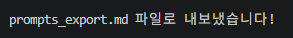

### 내보내진 Markdown 파일 내용
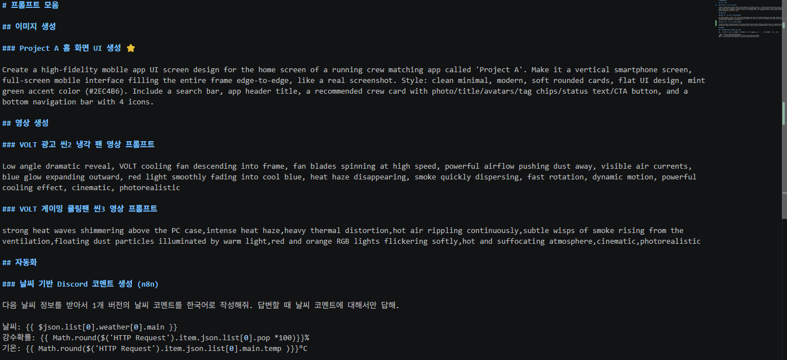

---

## Git 커밋 히스토리

기능 단위로 커밋을 분리했고, `feature/list` 브랜치를 생성해 프롬프트 목록 조회 기능을 작업한 뒤 `main`에 병합했습니다.

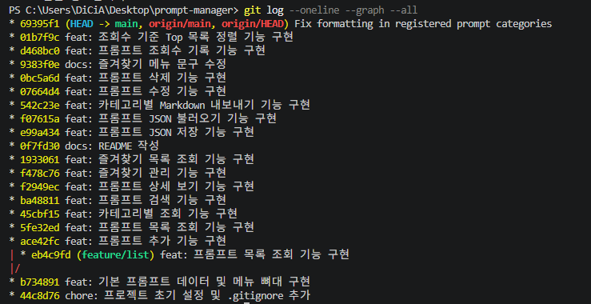

사용한 Git 명령어: `init`, `add`, `commit`, `push`, `pull`, `checkout`, `clone`, `merge`

---

## 개발 과정 메모

- `add_prompt()`와 `show_list()`를 커밋 하나에 같이 넣는 실수가 있었고, `git rebase -i`로 커밋을 두 개로 분리해 기능 단위 커밋 원칙을 지켰습니다.
- Git 사용자 정보는 공용 PC 환경을 고려해 `--global` 대신 `--local`로 설정해, 다른 사용자의 Git 환경에 영향을 주지 않도록 했습니다.
- `clone`은 별도 폴더에서 공개 저장소(`octocat/Hello-World`)를 내려받아 확인 후 삭제하는 방식으로 사용 기록을 남겼습니다.
- `pull`은 GitHub 웹에서 README를 직접 수정한 뒤 로컬에서 받아오는 방식으로 사용 기록을 남겼습니다.
